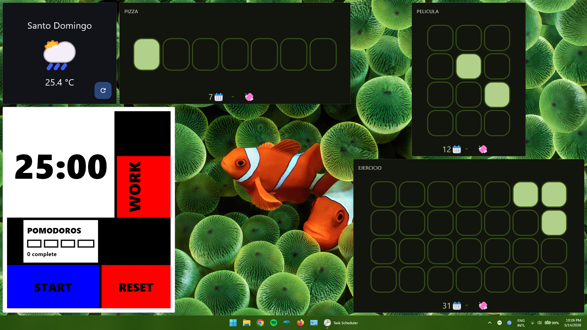

# Widgets4Windows

`Widgets4Windows` is a headless Dart controller for Windows 11 that:

- reads a `config.yaml` file,
- launches one process per configured widget entry,
- waits for each app's main window,
- snaps each window into a fullscreen grid on the primary display,
- keeps the managed windows pushed behind unrelated windows, and
- tears down all launched processes when the controller exits.

<p align="center">
  
</p>

## Config

`config.yaml` uses one `widgets` entry per desired app instance:

```yaml
grid:
  rows: 2
  columns: 3

widgets:
  - exe: notepad.exe
    row: 0
    column: 0
    rowSpan: 1
    columnSpan: 1
    args: []
```

Supported fields per widget:

- `grid.rows`, `grid.columns`: positive grid dimensions.
- `grid.padding`: optional non-negative pixel gap used both between windows and
  as the outer margin from the desktop edges.
- `exe`: native executable to launch. Relative executable paths are resolved
  using the controller process's inherited `PATH` environment variable, as
  when launching the executable from a terminal. Shell aliases, functions,
  and built-in commands are not supported.
- `args`: optional array of string arguments.
- `row`, `column`: non-negative, zero-based grid position.
- `rowSpan`, `columnSpan`: positive size in cells.
- `workingDirectory`: optional non-empty working-directory path.
- `windowPollTimeoutMs`: optional positive timeout in milliseconds while
  waiting for the window to appear.

If the same executable appears multiple times, the controller launches one separate instance for each entry.

## Run

1. Install the Dart SDK on Windows.
2. Run `dart pub get`
3. Update `config.yaml`
4. Start the wall with `dart run bin/widget_wall.dart config.yaml`

When compiled to an `.exe`, running without arguments loads `config.yaml` from the same directory as the executable.
To compile the controller and prevent a terminal window from opening when it is launched, use `editbin.exe` from a Visual Studio Developer PowerShell:

```powershell
dart compile exe .\bin\widget_wall.dart -o .\bin\w4w.exe
editbin.exe /SUBSYSTEM:WINDOWS .\bin\w4w.exe
```

Copy `config.yaml` next to the compiled executable if you want to run it without passing a config path.

Pass a custom config path if needed:

```powershell
dart run bin/widget_wall.dart .\my-wall.yaml
```

## MVP Notes

- The MVP targets the primary monitor's desktop work area, so the taskbar is respected when it is visible.
- Windows are resized and moved, but not forcibly made borderless.
- The z-order is reinforced on a timer by pushing managed windows to the bottom.
- Cleanup is primarily enforced through a Windows Job Object with `KILL_ON_JOB_CLOSE`.
- Apps that create a separate top-level window per launch work best. Modern single-instance or tabbed apps (for example current Windows 11 Notepad in some configurations) may reuse an existing window instead of creating one window per process, which limits how independently they can be tiled.
